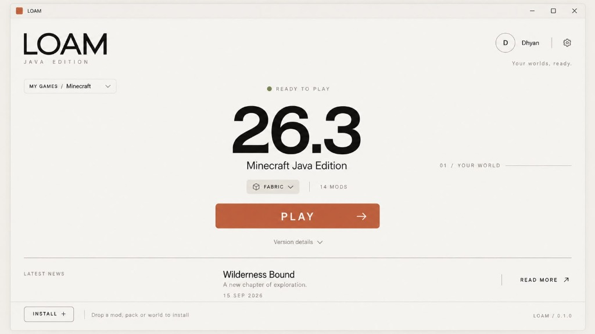
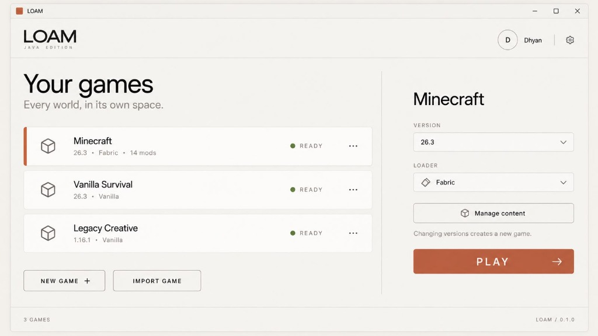
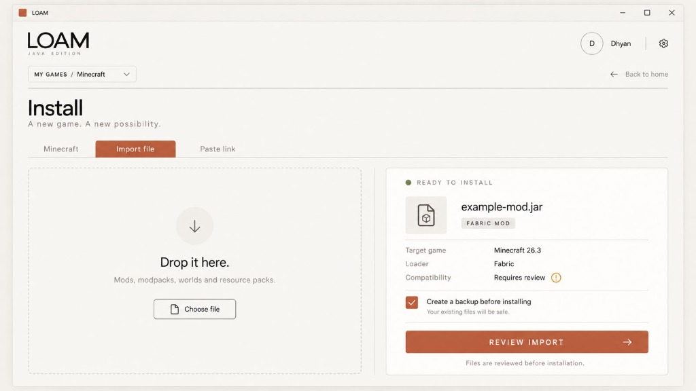
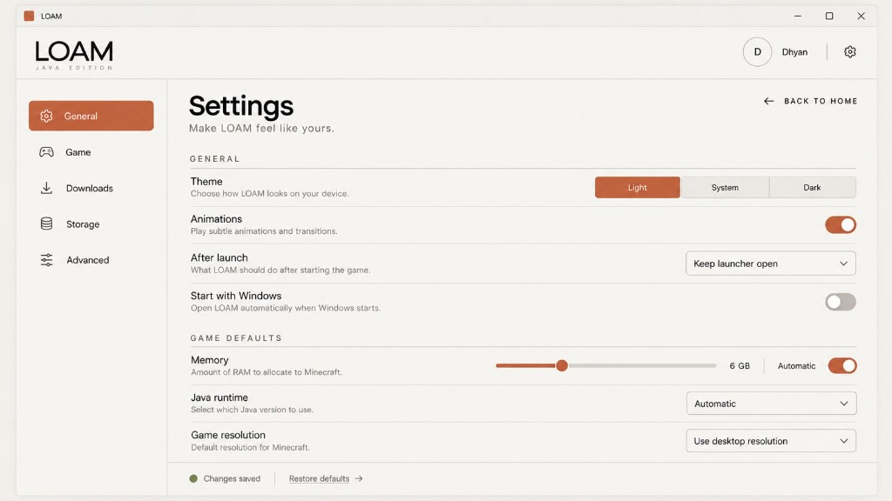

# LOAM

**Your worlds, ready.**

A calm, typography-led desktop launcher for Minecraft Java Edition.  
Engineered with Tauri 2, Rust, and React for Windows 10/11 x64.

 

---

## Direct Download & Installation

LOAM is distributed as a self-contained Windows setup executable. **No terminal, Node.js, Rust, or command prompt is required.**

### 📥 1. Download
Get the official setup executable for Windows 10 & 11 x64:

👉 **[Download LOAM Setup.exe (Latest Release)](https://github.com/whynotdhyan/loam-launcher/releases/latest/download/LOAM.Setup.exe)**  
*(Alternatively, view all releases and checksums on the [Releases Page](https://github.com/whynotdhyan/loam-launcher/releases))*

### 🚀 2. Install (One Click)
1. Double-click the downloaded **`LOAM Setup.exe`**.
2. Follow the standard Windows setup wizard (installs cleanly for the current user without requiring administrator privileges).
3. LOAM will open automatically and add a shortcut to your **Desktop** and **Start Menu**.

### 🎮 3. Play
1. **Choose your account:** Sign in with your **Microsoft Account** (with Xbox / Minecraft Java entitlement verification) or create an **Offline Profile** for local play and LAN.
2. **Select your game:** Pick between Vanilla or Fabric, adjust memory with the slider, or drop in your favorite mods and worlds.
3. Click **PLAY**. Your worlds, ready.

---

## Interface Gallery

### Your Games — Every world, in its own space
Seamlessly create, switch, and isolate vanilla and modded instances without directory clutter.
  

  

### Smart Drop & Import Review
Drag and drop Fabric mods, `.mrpack` modpacks, resource packs, shaders, or worlds with pre-flight inspection.
  

  

### Thoughtful, Restrained Settings
Manage Java runtimes, RAM allocation, storage directories, and appearance with pure Swiss typography.
  

---

## Key Features

* **Calm, High-Contrast Design**: Built on a locked 5-color palette (`#C15F3C` terracotta accent, `#F4F3EE` paper canvas, `#171715` ink) strictly conforming to WCAG 2.2 AA contrast rules.
* **Isolated Game Sandboxes**: Every game instance resides in its own isolated directory (`%APPDATA%\LOAM\games\<stable-id>`). Changing versions never silently breaks or modifies existing worlds.
* **Official Microsoft Authentication**: Secure OAuth 2.0 Authorization Code flow with PKCE via your default system browser. Zero passwords handled, zero embedded webviews. Tokens reside in the encrypted **Windows Credential Manager** (DPAPI).
* **Transparent Offline Profiles**: Clearly labeled offline profiles with deterministic vanilla UUID v3 generation for LAN, local testing, and offline-mode servers. Never claims fake entitlements.
* **Zero Credential Ingestion**: Importer strictly copies game assets (`saves/`, `mods/`, `options.txt`, `servers.dat`)—it never reads, parses, or touches credentials from other launchers (e.g. TLauncher).
* **Support & Integrated Redaction**: Built-in diagnostics generator producing Discord-ready Markdown (<1,800 characters) and redacted diagnostic bundles with 100% token and path sanitization.

---

## Account Capability Matrix

| Capability | Microsoft Account | Offline Profile | Third-Party Auth (Gate I) |
|---|:---:|:---:|:---:|
| Singleplayer & LAN | :white_check_mark: | :white_check_mark: | :white_check_mark: |
| Offline-Mode Servers | :white_check_mark: | :white_check_mark: | :white_check_mark: |
| Online-Mode Servers (Mojang Auth) | :white_check_mark: | :x: | :x: |
| Official Minecraft Realms | :white_check_mark: | :x: | :x: |
| Verified Ownership Badge | `MICROSOFT ✓` | `OFFLINE PROFILE` | `THIRD-PARTY · host` |
| Personal Skin / Cape | :white_check_mark: | Default Skin | Provider Skin |

---

## Keyboard Shortcuts

* <kbd>Ctrl</kbd> + <kbd>Enter</kbd> — Play active game
* <kbd>Ctrl</kbd> + <kbd>N</kbd> — Create new game installation (`INSTALL +`)
* <kbd>Ctrl</kbd> + <kbd>K</kbd> — Open Command Palette
* <kbd>Ctrl</kbd> + <kbd>,</kbd> — Open Settings
* <kbd>F1</kbd> — Open Support & Feedback
* <kbd>Esc</kbd> — Close active sheet or modal

---

## Privacy & Security

LOAM Launcher does not collect telemetry, analytics, or behavioral data.
* **Token Redaction**: All diagnostic logs pass through our Canary-tested regex sanitizer to strip bearer tokens, refresh tokens, and user filesystem paths before export.
* **Zero Credential Sharing**: We never ask for or store passwords. Microsoft authentication is handed directly to your default operating system browser.
* **Security Disclosures**: Please review our [Security Policy](SECURITY.md) to report vulnerabilities.

---

## Developer Documentation

For developers interested in compiling the Rust and React source code from scratch:
* [Architecture & Technical Design](docs/architecture.md)
* [Design System & CSS Tokens](docs/design-system.md)
* [Building from Source](docs/build.md)
* [Microsoft & Azure Setup Guide](docs/microsoft-setup.md)
* [Compatibility & Support Matrix](docs/support-matrix.md)

---

## Legal & Trademark Notice

LOAM is an independent open-source launcher licensed under the GNU General Public License v3.0.  
**Not an official Minecraft product. Not approved by or associated with Mojang or Microsoft.**  
Minecraft is a registered trademark of Mojang Synergies AB.
